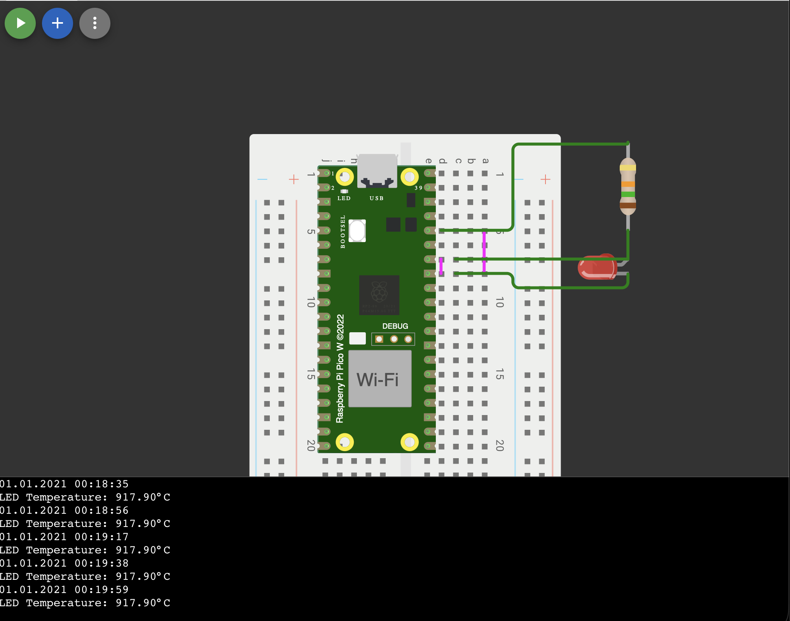

# Lämpötilan mittaus LEDin avulla käyttämällä Pico 2 W:tä

## Aloitus
Tämä projekti käyttää aliprojekteina seuraavia kirjastoja:
- [RPI-PICO-I2C-LCD)](https://github.com/T-622/RPI-PICO-I2C-LCD) (LCD näytöille)  
- [SH1106](https://github.com/robert-hh/SH1106) (SH1106 OLED näytöille)  

Aliprojektit voi alustaa seuraavilla komennoilla:
```
git submodule update --init
git submodule foreach "git submodule update --init"
```  
Jos et käytä referenssianturia tai näyttöä aliprojektit voi jättää pois.

### Komponentit
* Raspberry Pi Pico 2 W
* punainen LED esim häkävaroittimesta
* 15 kgΩ vastus LEDin rajoittamiseen
* 30 µF kondensaattori LEDin tasoittamiseen
* 100nF kondensaattori suodattamaan mittauskohinaa
* johdot ja leipälauta
* (Suositeltava) Cat5 kaapeli LEDille ja referenssi anturille mittausmatkan pidentämiseen
* (valinnainen) DHT22 tai SHT30 lämpötila- ja kosteusanturi
* (valinnainen) I2C LCD näyttö tai SH1106 OLED näyttö

## Konfigurointi
Aseta `main.py` tiedostossa:
  * led_adc: ADC pinni, johon LED on kytketty
  * led_ref_voltage: LEDin referenssijännite (esim. 3.3V)
  * led_ADC_bits: ADC bittisyvyys
  * led_temp_calibration: LEDin lämpötilakalibrointi
  * led_forward_voltage: LEDin jännite kalibrointipisteessä
  * led_coefficent: LEDin lämpötilakerroin  V/°C, esim. -0.0020
  * csv_filename: CSV tiedoston nimi, johon tallennetaan mittaustiedot
  * update_interval: Päivitysväli sekunteina

#### Vapaaehtoiset anturit ja näytöt
Avaa `peripherals.py` ja määritä haluamasi anturi ja näyttö, molemmat ovat vapaaehtoisia.  
Voit käyttää DHT22 tai SHT30 lämpötila- ja kosteusanturia referenssianturina.  
Näytöksi voi valita I2C LCD näytön tai SH1106 OLED näytön.  
Jos et käytä valinnaisia osia aseta `SCREEN_TYPE` ja `REF_TYPE` arvoksi `"None"`.

## Kytkentäkaavio

Wokwi diagrammi: [diagram.json](diagram.json)


## Käyttö
Jos käyttät näyttöä/ref-anturia, asenna ja siirrä Picolle tarvittavat kirjastot:
- I2C LCD:lle `pico_i2c_lcd.py` ja `lcd_api.py` tiedostot
- SH1106 OLED:lle `sh1106.py` tiedosto
- DHT22, sisäänrakennettu, ei toimenpiteitä
- SHT30:lle ???

Siirrä main.py ja peripherals.py Pico 2 W:lle ja suorita main.py